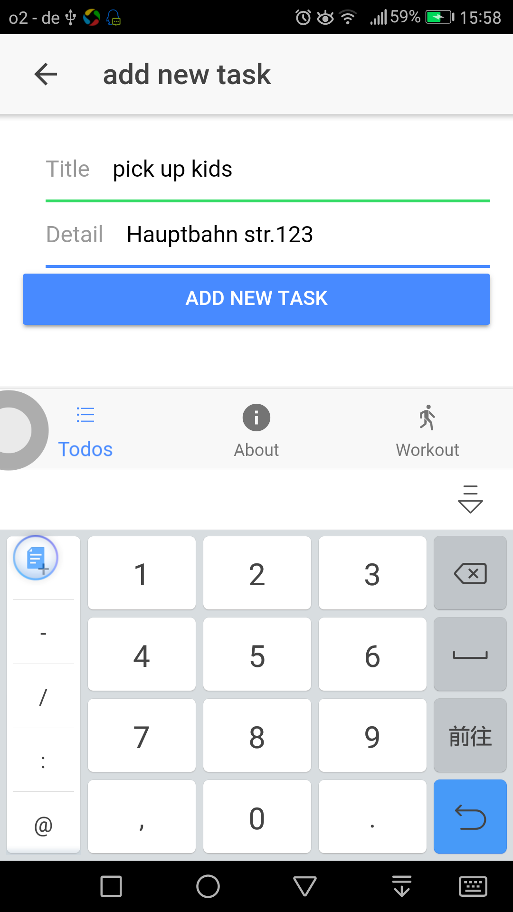
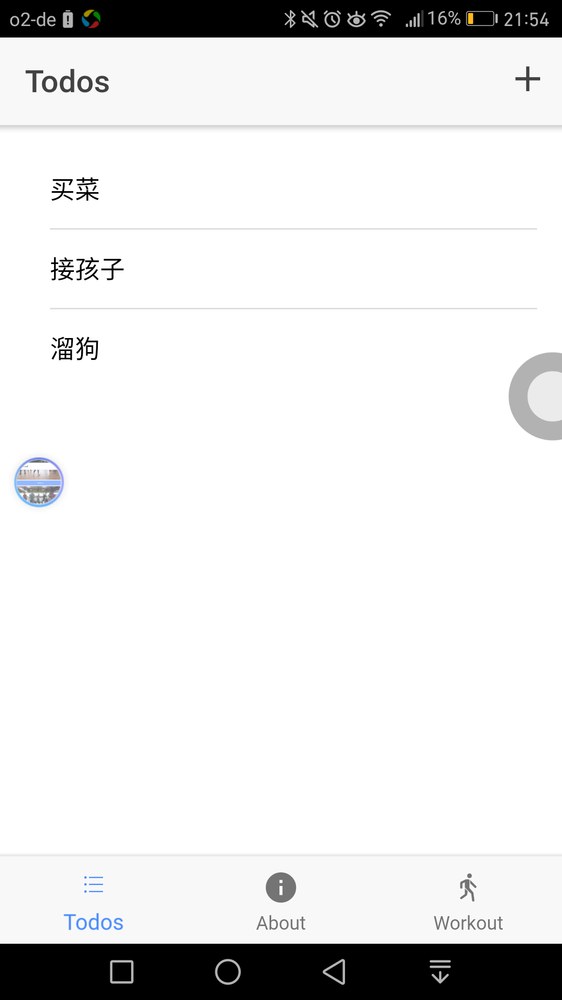
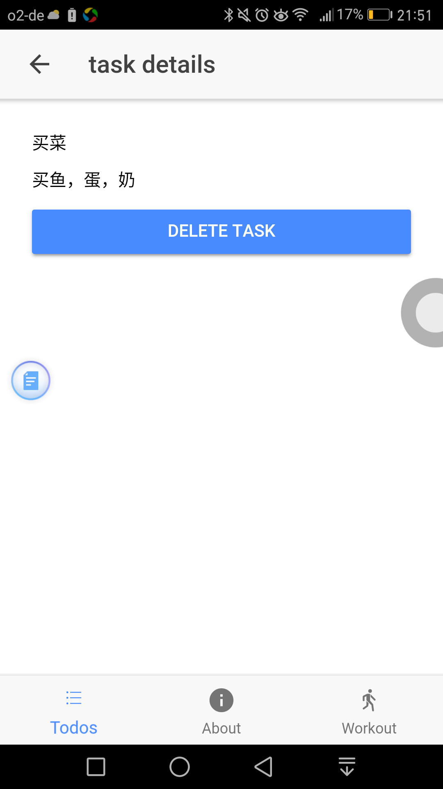
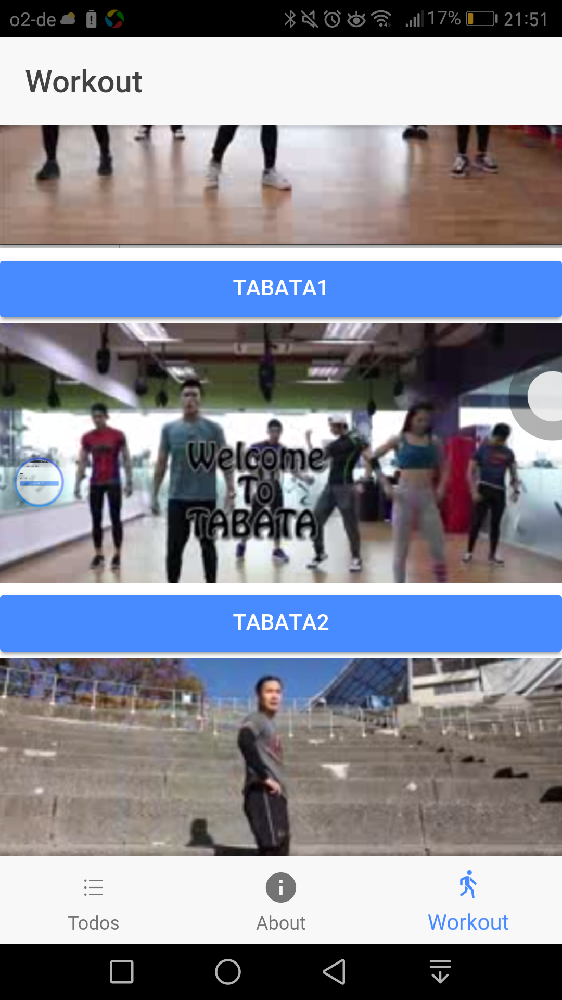
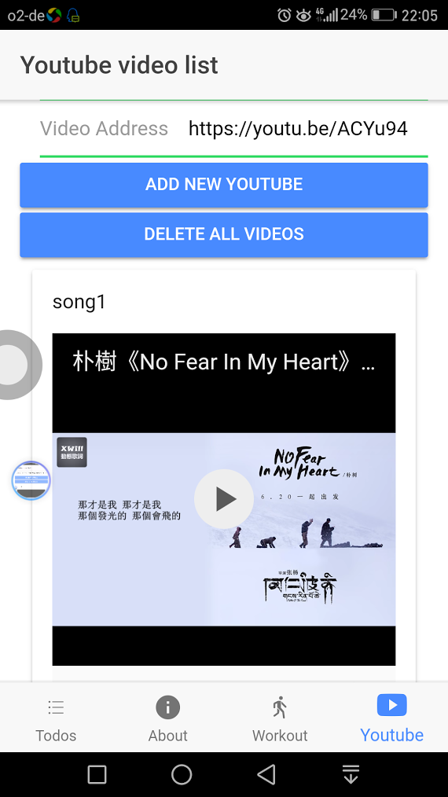
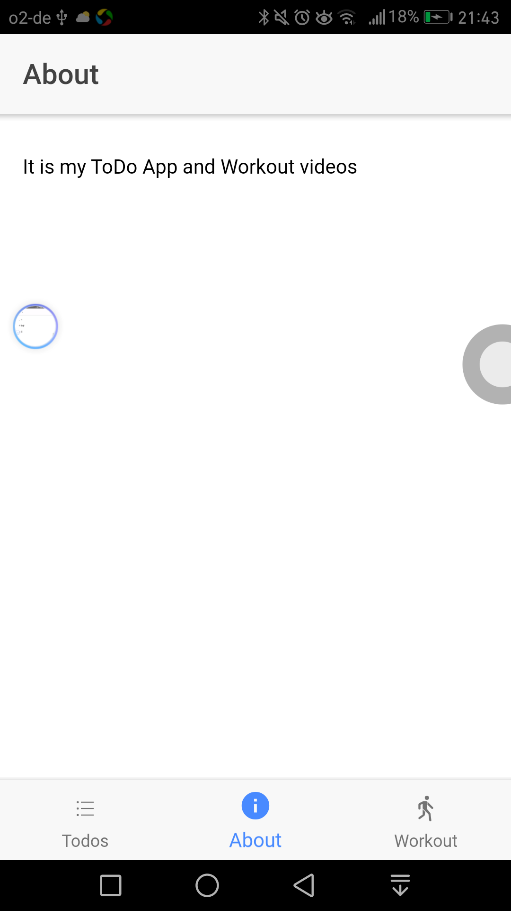

# It is a app to manage TODO tasks, workouts, youtube videos for myself

### install ionic and cordova

```
$ sudo npm install -g ionic cordova
```

Then, to run it, cd into `mytodo` and run:

```
$ ionic serve
```

### build snf publish to android or ios
http://ionicframework.com/docs/intro/deploying/


### add tasks



### list tasks



### delete task



###  workouts


### add delete list youtube videos


###  about


